# Banyumusic (v 1.0.0) #

> Oleh: Widia Rifkianti (4513215051)

(Tested only on Windows 10)

## Tujuan & Manfaat Aplikasi ##

Pada konsepnya, aplikasi ini diharapkan dapat menjadi aplikasi penyedia layanan musik-musik indie.
Sasaran pengguna adalah dari kalangan penikmat atau penggemar musik indie khususnya di Indonesia.

## Cara Instalasi & Eksekusi ##

1. Unduh *executable file* aplikasi [disini](https://github.com/widiarifki/banyumusic/raw/master/target/banyumusic.exe)
2. Masuk ke direktori dimana unduhan tersimpan lalu klik ganda pada icon *executable file* tersebut

> Catatan: Jika muncul peringatan seperti ini, klik **More Info** dan klik tombol **Run Anyway**
> 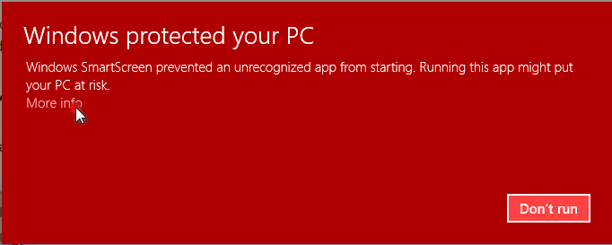
> 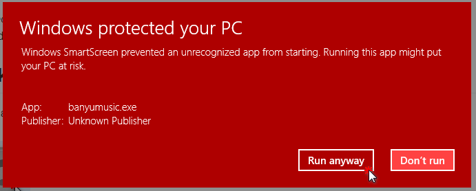

## Cara Pakai & Hasil yang Terjadi ##

1. Eksekusi hasil unduhan banyumusic.exe.

   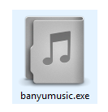

2. Jendela utama dari aplikasi akan muncul.

   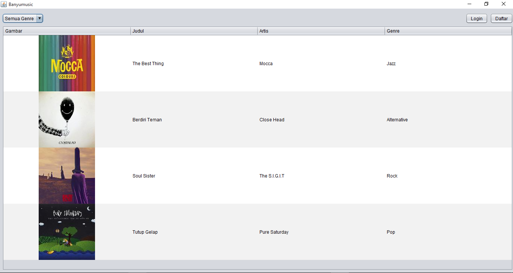

3. Saring lagu berdasar kategori genre menggunakan combobox atau *dropdown select* yang terdapat di pojok kiri jendela utama aplikasi.

   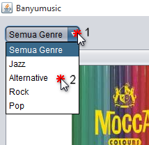

4. Agar dapat menambahkan lagu ke dalam *playlist*, buat akun terlebih dahulu dengan mengklik tombol **Daftar** yang terdapat di pojok atas kanan jendela utama.

   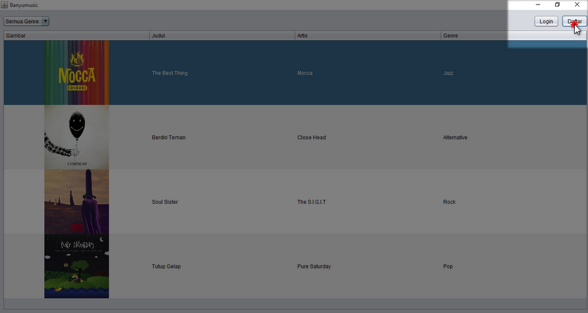

5. Jendela Registrasi akan muncul, isi data registrasi berdasarkan petunjuk. Klik tombol **Kirim** untuk mengirimkan data.

   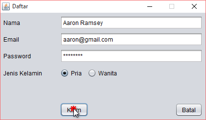

6. Setelah aplikasi mengenal anda sebagai pengguna terdaftar, anda dapat menambahkan setiap lagu ke *playlist* pribadi dengan mengklik ganda lagu yang dikehendaki di tabel.

   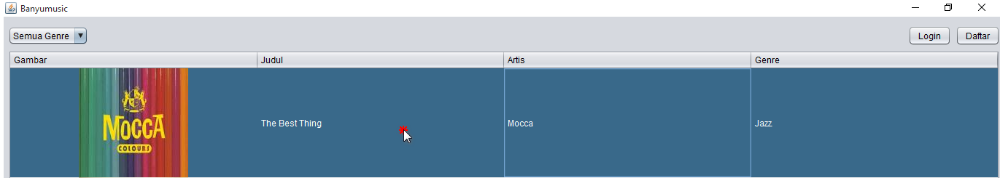

7. Jendela lagu akan muncul, klik tombol **Tambah ke Playlist** untuk menambahkan lagu ke *playlist* pribadi.

   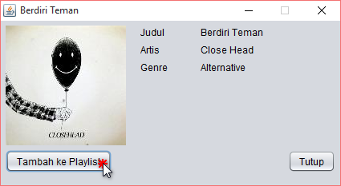

8. Klik tombol **My Playlist** yang terdapat di pojok kanan jendela utama untuk melihat daftar *playlist* pribadi yang telah anda masukkan.

   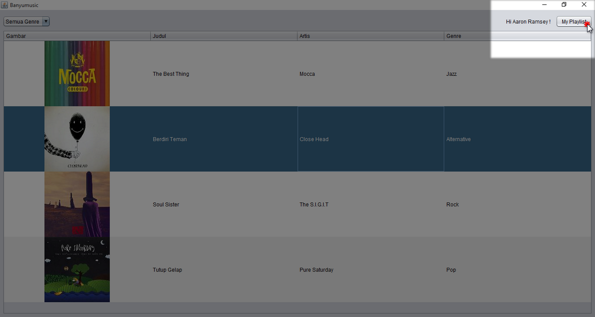

9. Untuk menghapus lagu dari playlist, klik ganda kembali lagu dari tabel playlist. Setelah jendela lagu muncul, klik **Hapus dari Playlist**.

   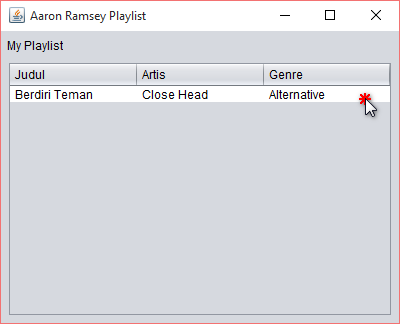 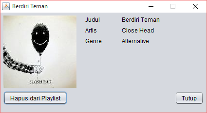

10. Untuk masuk kembali ke aplikasi klik tombol **Login** yang terdapat di pojok kanan atas jendela utama.

   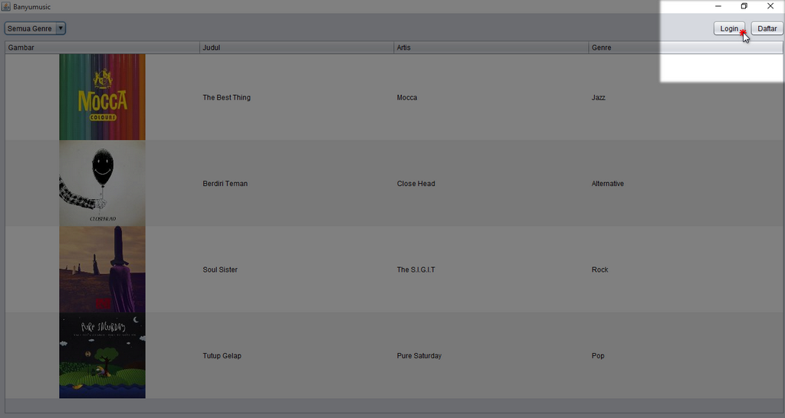

11. Isi data login lalu klik tombol **Login**.

   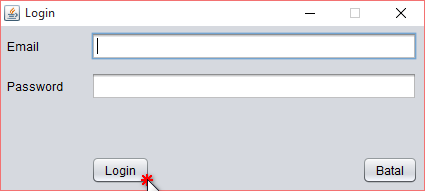
